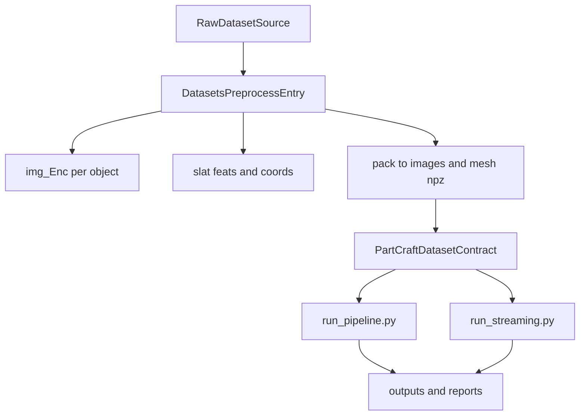

# PartCraft3D Architecture (Batch + Streaming)

## 主入口约定

- Batch 主入口：`scripts/run_pipeline.py`
- Streaming 主入口：`scripts/run_streaming.py`
- 约束：新增编排能力只能进入上述两个入口或其共享模块，不再新增并行的 standalone 编排前门。

## 共享编排层

- `scripts/pipeline_common.py`：配置读取、路径规范化、数据集构建、日志等共享能力。
- `scripts/pipeline_orchestrator.py`：`run_pipeline` 的主编排流程（context 构建、步骤执行、summary 收口）。
- `scripts/pipeline_paths.py`：shard/run token/report/manifest 路径派生与链接同步。
- `scripts/pipeline_jsonl.py`：JSONL 读写、去重、resume done 集合等通用逻辑。
- `scripts/pipeline_dispatch.py`：Step1/Step4 的多 worker 分发、等待、合并校验协议。
- `scripts/pipeline_diagnostics.py`：各 step 的统计诊断输出。
- `scripts/pipeline_step_3d.py`：Step4 3D 编辑核心逻辑拆分实现。

## Batch 流程职责

`scripts/run_pipeline.py` 负责 Step1-6 的可恢复批处理：

1. Step1 语义与 enrich
2. Step2 规划
3. Step3 2D 编辑预生成
4. Step4 TRELLIS 3D 编辑（支持多 GPU 分发）
5. Step5 质量评估
6. Step6 导出

输出遵循 shard 目录下 `pipeline/reports` 与 `pipeline/manifests`，保持 JSONL/resume 兼容。

## Streaming 流程职责

`scripts/run_streaming.py` 负责对象级流式处理，面向吞吐优先场景。与 batch 共用核心 phase 模块与 Step4 TRELLIS 能力。

## 数据预处理入口（scripts/datasets）

数据预处理的目标是把原始数据统一转换成 batch/streaming 可消费的数据契约：

- `data/*/images/{shard}/{obj_id}.npz`
- `data/*/mesh/{shard}/{obj_id}.npz`
- （可选）`data/*/slat/{shard}/{obj_id}_feats.pt`、`{obj_id}_coords.pt`

### 共享预处理能力

- `scripts/datasets/prerender_common.py`
  - GPU 发现、并行渲染调度、SLAT 编码、shard 切分与汇总。
  - `run_render/run_encode/launch_multi_gpu_encode` 支持显式 `dataset_root`，不再强依赖隐式环境变量。
  - 被 `partverse/prerender.py` 与 `partobjaverse/prerender.py` 复用。
- `partcraft/utils/config.py`
  - 预渲染模式下可启用 `load_config(..., for_prerender=True, prerender_mode=...)`。
  - 统一归一化 `paths.*`、`tools.*`，并将 `paths.images_npz_dir/mesh_npz_dir/slat_dir/img_enc_dir` 同步到 `data.*` 供 pipeline 侧复用。

## 预渲染配置驱动约定（新增）

预渲染链路采用“配置优先，机器无关”的路径契约。建议直接使用模板：

- `configs/prerender_partverse.yaml`
- `configs/prerender_partobjaverse.yaml`

关键字段：

- `paths.dataset_root`
- `paths.source_glb_dir`（PartVerse） / `paths.source_mesh_zip`（PartObjaverse）
- `paths.captions_json`（可选，PartVerse pack 使用）
- `paths.img_enc_dir`
- `paths.slat_dir`
- `paths.images_npz_dir`
- `paths.mesh_npz_dir`
- `tools.blender_path`
- `tools.blender_script`

行为规则：

- 预渲染脚本从 `--config` 读取路径，路径统一在配置层绝对化。
- 相对路径按项目根解析；迁移机器时优先仅改配置文件。
- 缺失关键键时 fail-fast 并指向对应配置项。
- 旧环境变量覆盖（`PARTVERSE_DATA_ROOT`、`PARTCRAFT_DATASET_ROOT`、`BLENDER_PATH`、`BLENDER_SCRIPT`）仅保留兼容并会给出 deprecation 提示。

### PartVerse 预处理链

- `scripts/datasets/partverse/prerender.py`
  - 主入口：`render -> encode -> pack`（支持 `--render-only/--pack-only/--encode-only`）。
  - 默认从 `configs/prerender_partverse.yaml` 读取路径；支持 `--config` 指定。
  - 产出：`img_Enc/`、`slat/{shard}/`、`images/{shard}/`、`mesh/{shard}/`。
- `scripts/datasets/partverse/pack_npz.py`
  - 将 `img_Enc` 和标注打包为 pipeline 输入 NPZ（含 `split_mesh.json`、`transforms.json`）。
- `scripts/datasets/partverse/repack_images_slim.py`
  - 对 `images/*.npz` 做视角瘦身，并可刷新 `part_id_to_name` 文本标签。
- `scripts/datasets/partverse/unpack_for_encode.py`
  - 从 NPZ 反解恢复 `img_Enc`（补跑 encode 时使用）。
- `scripts/datasets/partverse/verify_decode.py`
  - SLAT 解码可视化验收。
- `scripts/datasets/partverse/build_dino_test_dataset.py`
  - 构建 DINO/voxel 对齐测试集（研究与诊断用途）。

### PartObjaverse 预处理链

- `scripts/datasets/partobjaverse/prepare.py`
  - 数据准备入口：下载/解析 tiny 数据，转换到 `images/mesh` NPZ；可选 `--no-render`。
  - Blender 路径改为配置驱动：`tools.blender_path` / `tools.blender_script`（支持 CLI 覆盖）。
  - 可生成 `cache/phase0/semantic_labels.jsonl`。
- `scripts/datasets/partobjaverse/prerender.py`
  - 150 视角渲染 + SLAT 编码入口，使用 `paths.*` 统一读写目录。
- `scripts/datasets/partobjaverse/pack_npz.py`
  - 将 prerender 产物整理成 pipeline 输入 NPZ。
- `scripts/datasets/partobjaverse/build_dataset.py`
  - 从 pipeline 输出反向构建训练数据 JSON（后处理用途）。

## 端到端数据流

`scripts/pipeline_common.py` 的 `create_dataset()` 使用配置中的 `data.image_npz_dir` 与 `data.mesh_npz_dir` 构造 `PartCraftDataset`。因此 datasets 脚本与编辑入口之间的关键契约是 `images/mesh` NPZ 结构一致性。

## 保留目录

- `scripts/datasets/`：数据构建、预处理、打包、校验。
- `scripts/tools/`：运维与辅助工具（服务、下载、对比、测试等）。
- `scripts/vis/`：可视化与渲染辅助。
- `scripts/standalone/encode_slat.py`：保留为编码工具脚本（非主入口）。

## 已清理的冗余入口/模块

### 已删除 standalone 入口

- `scripts/standalone/run_all.py`
- `scripts/standalone/run_phase0.py`
- `scripts/standalone/run_phase1.py`
- `scripts/standalone/run_phase2.py`
- `scripts/standalone/run_phase2_5.py`
- `scripts/standalone/run_phase3.py`
- `scripts/standalone/run_enrich.py`
- `scripts/standalone/test_editformer.py`

### 已删除未使用阶段模块

- `partcraft/phase3_render/renderer.py`

## 非删除保留（风险控制）

以下文件虽非双入口直接 import，但属于可选路径或潜在配置分支，当前保留：

- `partcraft/phase3_filter/filter.py`
- `partcraft/phase2_assembly/alignment.py`

## 后续演进规则

- 不新增第三条主编排入口。
- 若引入新步骤，优先扩展 `run_pipeline` 的 step 体系和共享 `pipeline_*` 模块。
- streaming 侧只保留对象级增量能力，避免重复实现 batch 的全量编排语义。
