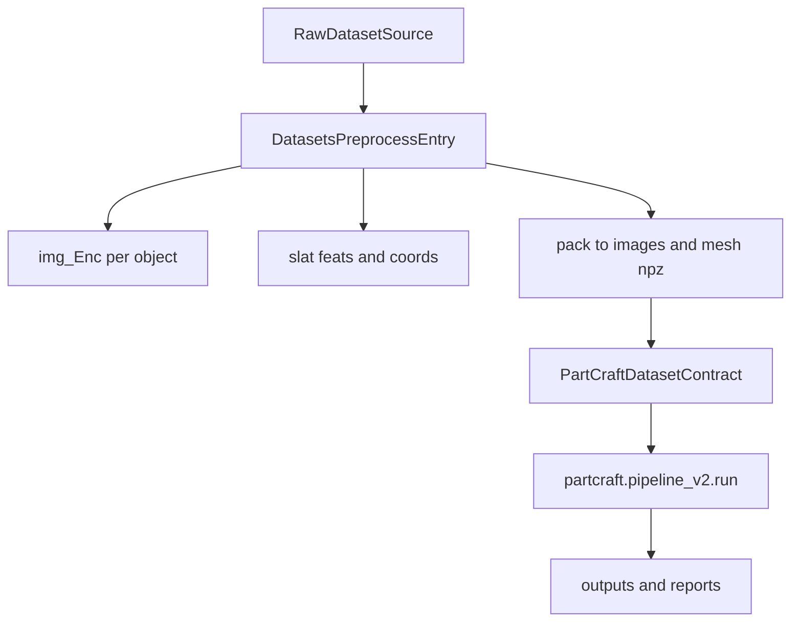

# PartCraft3D Architecture (Batch + Streaming)

## 主入口约定

- **Pipeline v2 主入口（推荐，object-centric）**：
  - Python 编排：`python -m partcraft.pipeline_v2.run --config <yaml> --shard <NN> --all --stage <A|C|D|D2|E|F>`
  - Shell 调度（自动起停 VLM/FLUX 服务、按 stage 顺序执行）：`bash scripts/tools/run_pipeline_v2_shard.sh <tag> <config_yaml>`
    - `STAGES=A,C,D,D2,E,F` 可定制子集；省略则跑 config 的 `pipeline.stages` 默认列表
    - 服务/GPU/端口完全由 config 的 `pipeline:` 段（`gpus`、`vlm_port_base/stride`、`flux_port_base/stride`）派生，N-GPU agnostic
  - 模块布局：`partcraft/pipeline_v2/{run,scheduler,specs,paths,status,validators,s1_phase1_vlm,s2_highlights,s4_flux_2d,s5_trellis_3d,s5b_deletion,s6_render_3d,s7_addition_backfill}.py`
  - Resume：每 step 跑完调用 `validators.apply_check`,根据磁盘产物把 `status.json` 翻成 OK/FAIL/SKIP；下一轮 step 在 per-edit 粒度上只补缺失文件
- 约束：所有编排能力只能进入 pipeline_v2 入口及其模块，不再新增任何并行编排入口。
- **配置命名**：`configs/pipeline_v2_*.yaml` 与流式/PartVerse 模板使用顶层 `services.vlm` / `services.image_edit`、`pipeline.stages`、`step_params`；代码只从上述键读取（不再写入 legacy `phase0` / `phase2_5`）。


## 数据预处理入口（scripts/datasets）

数据预处理的目标是把原始数据统一转换成 batch/streaming 可消费的数据契约：

- `data/*/images/{shard}/{obj_id}.npz`  — 打包后的多视角渲染图（`image_npz_dir`）
- `data/*/mesh/{shard}/{obj_id}.npz`    — 打包后的网格（含 `full.ply`）（`mesh_npz_dir`）
- `data/*/slat/{shard}/{obj_id}_feats.pt`、`{obj_id}_coords.pt`  — SLAT 编码（`slat_dir`）

### 管线 vs 预渲染数据路径职责（2026-03-30 对齐）

- **Pipeline `data.*` 键名与 `image_npz_dir` 对齐规则**：见 [`dataset-path-contract.md`](dataset-path-contract.md)。


- **预渲染**产出并依赖 `img_Enc/`（`paths.img_enc_dir`）：原始渲染图 + `mesh.ply`
- **编辑管线**只依赖打包后的产物：`images/*.npz`、`mesh/*.npz`、`slat/`
- `derive_dataset_subpaths: true` 只自动派生 `image_npz_dir`、`mesh_npz_dir`、`slat_dir`，**不派生 `img_enc_dir`**
- `img_enc_dir` 在管线中唯一消费点是 `trellis_refine.py` 加载 VD mesh 的可选 fallback；不存在时从 `mesh.npz` 中读 `full.ply`

### 共享预处理能力

- `scripts/datasets/prerender_common.py`
  - GPU 发现、并行渲染调度、SLAT 编码、shard 切分与汇总。
  - `run_render/run_encode/launch_multi_gpu_encode` 支持显式 `dataset_root`，不再强依赖隐式环境变量。
  - 被 `partverse/prerender.py` 与 `partobjaverse/prerender.py` 复用。
- `partcraft/utils/config.py`
  - 预渲染模式下可启用 `load_config(..., for_prerender=True, prerender_mode=...)`。
  - 统一归一化 `paths.*`、`tools.*`，并将 `paths.images_npz_dir/mesh_npz_dir/slat_dir/img_enc_dir` 同步到 `data.*` 供 pipeline 侧复用。

## 预渲染配置驱动约定（新增）

预渲染链路采用“配置优先，机器无关”的路径契约。建议直接使用模板：

- `configs/prerender_partverse.yaml`
- `configs/prerender_partobjaverse.yaml`

关键字段：

- `paths.dataset_root`
- `paths.source_glb_dir`（PartVerse） / `paths.source_mesh_zip`（PartObjaverse）
- `paths.captions_json`（可选，PartVerse pack 使用）
- `paths.img_enc_dir`
- `paths.slat_dir`
- `paths.images_npz_dir`
- `paths.mesh_npz_dir`
- `tools.blender_path`
- `tools.blender_script`

行为规则：

- 预渲染脚本从 `--config` 读取路径，路径统一在配置层绝对化。
- 相对路径按项目根解析；迁移机器时优先仅改配置文件。
- 缺失关键键时 fail-fast 并指向对应配置项。
- 旧环境变量覆盖（`PARTVERSE_DATA_ROOT`、`PARTCRAFT_DATASET_ROOT`、`BLENDER_PATH`、`BLENDER_SCRIPT`）仅保留兼容并会给出 deprecation 提示。

### 严格配置模式（2026-03-29）

预渲染与管线执行改为“配置显式声明 + 启动期失败”：

- 关键路径不再在运行时隐式 fallback（例如 `dataset_root`、`slat_dir`、`img_enc_dir`、`image_edit_base_url`）。
- 缺失配置或路径无效时，直接抛出 `[CONFIG_ERROR]` 并包含 key、解析后的值、来源（config/env_override/derived）。
- `partcraft/utils/config.py` 会在加载后打印 `[CONFIG_PATH]`，用于审计最终生效路径与来源。
- `partcraft.pipeline_v2.run` 与 `prerender.py` 在 step 入口执行强校验，不再警告后跳过。

### PartVerse 预处理链

- `scripts/datasets/partverse/prerender.py`
  - 主入口：`render -> encode -> pack`（支持 `--render-only/--pack-only/--encode-only`）。
  - 默认从 `configs/prerender_partverse.yaml` 读取路径；支持 `--config` 指定。
  - 产出：`img_Enc/`、`slat/{shard}/`、`images/{shard}/`、`mesh/{shard}/`。
  - `--num-gpus N`：多 GPU 并行 SLAT encode，已编码对象自动跳过（缓存 `{obj_id}_feats.pt`）。
  - `--pack-workers N`：多进程并行 pack（CPU 密集，推荐 32–64），已打包 NPZ 自动跳过。
- `scripts/datasets/partverse/pack_npz.py`
  - 将 `img_Enc` 和标注打包为 pipeline 输入 NPZ（含 `split_mesh.json`、`transforms.json`）。
  - 核心函数 `_pack_one` 和 `PACK_VIEWS` 被 `prerender.py` 复用；推荐通过 `prerender.py --pack-only` 调用。
- `scripts/datasets/partverse/repack_images_slim.py`
  - 对 `images/*.npz` 做视角瘦身，并可刷新 `part_id_to_name` 文本标签。
- `scripts/datasets/partverse/unpack_for_encode.py`
  - 从 NPZ 反解恢复 `img_Enc`（补跑 encode 时使用）。
- `scripts/datasets/partverse/verify_decode.py`
  - SLAT 解码可视化验收。
- `scripts/datasets/partverse/build_dino_test_dataset.py`
  - 构建 DINO/voxel 对齐测试集（研究与诊断用途）。

### PartObjaverse 预处理链

- `scripts/datasets/partobjaverse/prepare.py`
  - 数据准备入口：下载/解析 tiny 数据，转换到 `images/mesh` NPZ；可选 `--no-render`。
  - Blender 路径改为配置驱动：`tools.blender_path` / `tools.blender_script`（支持 CLI 覆盖）。
  - 可生成 `cache/phase0/semantic_labels.jsonl`。
- `scripts/datasets/partobjaverse/prerender.py`
  - 150 视角渲染 + SLAT 编码入口，使用 `paths.*` 统一读写目录。
- `scripts/datasets/partobjaverse/pack_npz.py`
  - 将 prerender 产物整理成 pipeline 输入 NPZ。


## 端到端数据流



`partcraft/pipeline_v2/` 各 step 通过 `ObjectContext` 访问每个对象的 `image_npz` / `mesh_npz` 路径。datasets 脚本与编辑入口之间的关键契约是 `images/mesh` NPZ 结构一致性。

## 保留目录

- `scripts/datasets/`：数据构建、预处理、打包、校验。
- `scripts/tools/`：运维与辅助工具（服务、下载、对比、测试等）。
- `scripts/vis/`：可视化与渲染辅助（见下方「可视化工具」一节）。


## 管线运行入口

- **Smoke / 调试子集：** 见 [`smoke-pipeline.md`](smoke-pipeline.md)（`--dry-run`、`LIMIT`）。

推荐使用 `bash scripts/tools/run_pipeline_v2_shard.sh <tag> <config_yaml>` 作为 shard 级运行入口，或直接调用 `python -m partcraft.pipeline_v2.run`（见上方主入口约定）。

### tmux 会话（长期跑 / 多面板）

- **适用**：SSH 易断线、phase 耗时长、需要同时看日志与交互式 tail；**在仓库根**执行（`run_pipeline_v2_shard.sh` 会 `cd` 到项目根）。
- **单会话跑完整 shard**：`tmux new -s pc3d` → 在会话内 `export` 需要的 `STAGES`/ `MACHINE_ENV`（可选）→ 执行 `bash scripts/tools/run_pipeline_v2_shard.sh <tag> <config_yaml>`；断线后 `tmux attach -t pc3d` 回到同一进程。
- **常用快捷键**：`Ctrl-b d` detach；`Ctrl-b c` 新窗口；`Ctrl-b "` / `%` 分屏；`Ctrl-b [` 进入滚动/复制模式。
- **多面板拆分（示例）**：窗口 0 跑管线编排；若需**手动**起 VLM / FLUX（与脚本自动起停并存时以脚本为准），另开窗口按机器上的 `scripts/tools/launch_local_vlm.sh`、`scripts/tools/image_edit_server.py` 等启动，端口须与 config 中 `pipeline.vlm_port_base` / `flux_port_base` 及 `pipeline.gpus` 派生结果一致。
- **环境变量**：tmux 面板继承启动该面板的 shell 环境；跨机器请优先把路径写进 `configs/machine/$(hostname).env`，或用 `MACHINE_ENV=configs/machine/xxx.env` 单次注入，避免只在某一面板 `export` 导致另一面板缺变量。

### 机器配置驱动

- **新机器 onboarding（唯一详细步骤）**：见 [`new-machine-onboarding.md`](new-machine-onboarding.md)。

所有机器相关路径（conda、checkpoint、数据）集中在 `configs/machine/<hostname>.env`，脚本启动时按 `$(hostname)` 自动加载。迁移新机器只需：

1. `cp configs/machine/node39.env configs/machine/<新主机名>.env`
2. 编辑路径
3. `SHARD=01 bash scripts/tools/run_pipeline_v2_shard.sh <tag> <config_yaml>`

当前仓库已提供：

- `configs/machine/node39.env`
- `configs/machine/H200.env`（本机命名模板）
- `configs/machine/dedicated-developjob-saining-data-rio9a.env`（本机实际配置，blender/ckpt 路径已对齐）

### 环境初始化脚本（部署/管线分离）

推荐先执行环境初始化，再运行 batch 管线：

- `scripts/tools/setup_deploy_env.sh`
  - 配置并校验 `CONDA_ENV_SERVER`（VLM + image edit 服务环境）
  - 默认读取 `configs/machine/$(hostname).env`，可用 `--machine-env` 覆盖
- `scripts/tools/setup_pipeline_env.sh`
  - 配置并校验 `CONDA_ENV_PIPELINE`（`partcraft.pipeline_v2` 管线运行环境）
  - 默认读取 `configs/machine/$(hostname).env`，可用 `--machine-env` 覆盖

常用命令：

```bash
bash scripts/tools/setup_deploy_env.sh
bash scripts/tools/setup_pipeline_env.sh

# 仅检查 machine env 与 conda 激活，不安装依赖
bash scripts/tools/setup_deploy_env.sh --check
bash scripts/tools/setup_pipeline_env.sh --check
```

本机适配示例：

- `configs/machine/<hostname>.env`（机器相关路径集中在此文件，无需修改代码）

### 环境变量

| 变量 | 说明 | 示例 |
|------|------|------|
| `STAGES` | 执行阶段（对应 config `pipeline.stages[].name`） | `A,C,D,D2,E,F` 或省略（跑全部） |
| `LIMIT` | 限制对象数（调试用）；`pipeline_v2.run` 在解析对象列表并经过 `--gpu-shard` 后取前 N 个 | `3` |

### GPU 资源生命周期

同一组 GPU 在 phase 间复用，每 phase 结束后自动 kill 服务释放显存：

- Phase A（s1 VLM）：启动 SGLang VLM → Phase 1 推理 → kill VLM
- Phase C（s4 FLUX）：启动 FLUX 服务 → 2D 编辑 → kill FLUX
- Phase D（s5 TRELLIS）：子进程加载 TRELLIS → 3D 编辑 → 子进程退出
- Phase D2（s5b deletion）、E（s6 rerender）、F（s7 backfill）：CPU 为主或短 GPU burst

### machine env 必填字段

```
CONDA_INIT, CONDA_ENV_SERVER, CONDA_ENV_PIPELINE
VLM_CKPT, EDIT_CKPT, TRELLIS_CKPT_ROOT
DATA_DIR, OUTPUT_ROOT
```

### 权重下载与目录规范（本机）

- 权重根目录由 machine env 的 `PARTCRAFT_CKPT_ROOT` 或 `VLM_CKPT` / `EDIT_CKPT` / `TRELLIS_CKPT_ROOT` 指定。
- 缺失本地推理权重时，使用：
  - `bash scripts/tools/download_local_missing_weights.sh`
- 可通过 `VLM_REPO_ID` / `EDIT_REPO_ID` / `PARTCRAFT_CKPT_ROOT` 覆盖默认仓库与目录，无需修改代码。

## 训练数据契约（Object-Centric Edit Pairs）

管线产出的 `mesh_pairs/{edit_id}/` 平铺布局用于生产；训练侧使用 **按物体聚合** 的重组格式。

### 目录结构

```
partverse_pairs/                         # 训练数据根目录
  shard_XX/
    {obj_id}/
      original.npz                       # 共享 before 状态（唯一一份）
      mod_000.npz                        # 各编辑的 after 状态
      scl_000.npz
      del_000.npz
      ...
      metadata.json                      # 物体 + 所有编辑元数据
  manifest.jsonl                         # 全局扁平索引（一行一条编辑）
```

- 每个 NPZ 含 `slat_feats [N,8]`、`slat_coords [N,4]`、`ss [8,16,16,16]`
- addition / identity 不产出文件，通过 `metadata.json` 引用（addition 反转对应 deletion，identity 引用 original）

### 从管线产出转换

```bash
python scripts/tools/repack_to_object_dirs.py \
    --mesh-pairs <mesh_pairs_dir> \
    --specs-jsonl <edit_specs.jsonl> \
    --output-dir <partverse_pairs> \
    --shard XX
```

### DataLoader API

```python
from partcraft.io.edit_pair_dataset import EditPairDataset
from partcraft.io.edit_pair_sampler import ObjectGroupedSampler

dataset = EditPairDataset(
    root="partverse_pairs",
    shards=["00", "05", "06", "07"],
    edit_types={"modification", "scale", "material", "global"},
    max_voxels=32768,
)

sampler = ObjectGroupedSampler(dataset, shuffle=True)

loader = DataLoader(
    dataset,
    batch_size=4,
    sampler=sampler,
    collate_fn=EditPairDataset.collate_fn,
    num_workers=4,
    pin_memory=True,
)

for batch in loader:
    before_slat = batch["before_slat"]   # SparseTensor
    after_slat  = batch["after_slat"]    # SparseTensor
    before_ss   = batch["before_ss"]     # [B, 8, 16, 16, 16]
    after_ss    = batch["after_ss"]      # [B, 8, 16, 16, 16]
    prompts     = batch["prompt"]        # list[str]
```

- `ObjectGroupedSampler` 按物体分组采样，最大化 `original.npz` 的 LRU 缓存命中
- `collate_fn` 遵循 Trellis `SLat.collate_fn` 的 SparseTensor 拼接协议（batch-index prepend + layout slices）

## 数据清洗（Step 7 / 独立工具）

对 `repack_to_object_dirs.py` 产出的 object-centric 训练数据进行质量过滤。

### 推荐流程（2026-04-05 对齐：先清洗后编码）

Step4 产出平铺 `mesh_pairs/` 后，推荐按以下顺序执行：

```
Step4 flat mesh_pairs/
  ↓
repack（object-centric，deletion 此时只有 PLY，无 after.npz）
  ↓
Phase 1（mod/scl/mat/glb 旧 SLAT → NPZ，与 deletion 无关）
  ↓
VLM 统一清洗（deletion 用 PLY→Blender，其他用 NPZ→TRELLIS Gaussian）
  ↓
Phase 5（只 encode 通过清洗的 deletion → SLAT+SS，--include-list 过滤）
  ↓
Phase 3/4（addition backfill + identity backfill）
```

**核心优势**：Phase 5（Blender 40 views + DINOv2 + SLAT enc + SS enc）是最贵的步骤，先清洗可跳过被过滤的 deletion，节省 30-40% 编码量。

### 过滤架构（2026-04-05 统一 VLM prompt + 3-view）

**主路径：VLM 清洗**（`scripts/tools/run_vlm_cleaning.py`）
- 渲染 before/after **3 视角**对比图 → Qwen VLM 结构化评分 → tier 分类
- **8 维评分**（统一 prompt，`partcraft/cleaning/vlm_filter.py:build_judge_prompt`）：
  - Part 1 编辑质量：edit_executed、correct_region、preserve_other、visual_quality、artifact_free
  - Part 2 Prompt 质量：prompt_quality (1-5)、improved_prompt、improved_after_desc
- 两种渲染路径：PLY → Blender（deletion）/ NPZ → TRELLIS Gaussian（其他类型）
- 空 prompt 时 VLM 从图像推断编辑内容并生成 prompt
- 核心函数在 `partcraft/cleaning/vlm_filter.py`
- Mesh prefilter 函数在 `partcraft/cleaning/_mesh_metrics.py`（内部模块）

**3-view 最优覆盖角度**（Blender 与 TRELLIS Gaussian 统一）：

| 视角 | Yaw | Pitch | 覆盖 |
|------|-----|-------|------|
| 1 | 0° | 26° (0.45 rad) | 正前 + 两侧 |
| 2 | 120° | 26° (0.45 rad) | 右后方 |
| 3 | 240° | 63° (1.1 rad) | 左后方 + 顶部 |

定义：`render_ply_pairs.py:_THREE_VIEWS`、`vlm_filter.py:_VLM_YAWS/_VLM_PITCHES`

**备用路径：计算型清洗**（`scripts/tools/run_cleaning.py`，无 GPU 时可用）
1. **Layer 1（NPZ 健全性）**：`partcraft/cleaning/npz_checks.py`
   - 体素数范围、特征值域（NaN/Inf/常量）、SS 值域、坐标合法性/唯一性
2. **Layer 2（编辑对比）**：`partcraft/cleaning/pair_checks.py`
   - 按编辑类型分发 7 类检查（体素比、连通性、SS 相似度等）

**共享 NPZ 工具**：`partcraft/io/npz_utils.py`
- `save_npz()` / `encode_ss()` / `load_ss_encoder()` — 被 `migrate_slat_to_npz.py` 和 `trellis_refine.py` 共用

### NPZ 迁移 `migrate_slat_to_npz.py`（2026-04-05 精简）

`scripts/tools/migrate_slat_to_npz.py` 将 Step4 产出统一为训练就绪 NPZ，4 个 Phase：

| Phase | 功能 | 处理对象 | 资源 |
|-------|------|---------|------|
| **1** | 旧 `*_slat/` → NPZ 转换 | mod/scale/mat/glb 的旧 `feats.pt+coords.pt` → 编码 SS → 写 NPZ | GPU（SS encoder） |
| **3** | Addition backfill | 复制 deletion 的 `before.npz` ↔ `after.npz` 互换（硬链接） | CPU |
| **4** | Identity backfill | 硬链接同物体已有 `before.npz` 作为 before 和 after | CPU |
| **5** | **Deletion PLY → SLAT+SS 重编码** | 仅 deletion 的 `after.ply`，支持 `--include-list` 过滤 | GPU（Blender + DINOv2 + SLAT enc + SS enc） |

推荐执行顺序：Phase 1 → VLM 清洗 → Phase 5（仅通过的 deletion）→ Phase 3,4。

```bash
# Phase 1：旧格式转换（清洗前）
python scripts/tools/migrate_slat_to_npz.py \
    --config configs/partverse_node39_shard01.yaml \
    --mesh-pairs outputs/partverse/shard_01/mesh_pairs_shard01 \
    --specs-jsonl outputs/partverse/shard_01/cache/phase1/edit_specs_shard01.jsonl \
    --phase 1

# VLM 清洗（见下方）→ 产出通过的 deletion 列表

# Phase 5：只编码通过清洗的 deletion
python scripts/tools/migrate_slat_to_npz.py \
    --phase 5 --include-list passed_deletion_ids.txt \
    --blender-path /path/to/blender --dino-views 40 ...

# Phase 3,4：addition/identity backfill
python scripts/tools/migrate_slat_to_npz.py --phase 3,4 ...
```

### VLM 清洗 `run_vlm_cleaning.py`

`scripts/tools/run_vlm_cleaning.py` 直接对 repacked 数据做 VLM 质量筛选（主路径）。

**编辑类型处理策略**：

| 类型 | 渲染路径 | 是否需要 TRELLIS GPU | 备注 |
|------|---------|---------------------|------|
| **deletion** | PLY → Blender 3 views | 否（Blender CPU/GPU） | before.ply + after.ply 均有真实网格 |
| **addition** | 不评（继承 deletion 分数） | — | before/after 互换，质量等价 |
| **modification** | NPZ → TRELLIS decode → Gaussian 3 views | 是 | PLY 是点云（0 面），无法 Blender 渲染 |
| **scale** | 同 modification | 是 | |
| **material** | 同 modification | 是 | |
| **global** | 同 modification | 是 | |
| **identity** | 不评（自动 high） | — | 引用同一 `original.npz` |

**评分维度**（统一 prompt，`partcraft/cleaning/vlm_filter.py`）：

| 维度 | 类型 | 说明 |
|------|------|------|
| `edit_executed` | bool | 编辑是否可见地发生 |
| `correct_region` | bool | 是否修改了正确部件 |
| `preserve_other` | bool | 其他部分是否完好 |
| `visual_quality` | 1-5 | AFTER 模型视觉质量 |
| `artifact_free` | bool | 无浮块/破面/缺失 |
| `prompt_quality` | 1-5 | edit_prompt 与视觉变化的匹配度 |
| `improved_prompt` | str | VLM 改写的更精确的 edit_prompt |
| `improved_after_desc` | str | VLM 描述的 AFTER 物体 |

加权合成 → tier 分类（high / medium / low / negative / rejected）。

**运行方式**：

```bash
# 1. 启动 Qwen VLM 服务（GPU 0）
conda activate qwen_test
CUDA_VISIBLE_DEVICES=0 VLM_MODEL=/Node11_nvme/zsn/checkpoints/Qwen3.5-27B \
    bash scripts/tools/launch_local_vlm.sh

# 2a. 仅 deletion（无需 TRELLIS，快，推荐先跑）
python scripts/tools/run_vlm_cleaning.py \
    --root outputs/partverse/partverse_pairs \
    --output-root outputs/partverse \
    --shards 01 --only-types deletion

# 2b. 其他类型（TRELLIS on GPU 3）
CUDA_VISIBLE_DEVICES=3 python scripts/tools/run_vlm_cleaning.py \
    --root outputs/partverse/partverse_pairs \
    --output-root outputs/partverse \
    --shards 01 --only-types modification scale material global

# 2c. 多 GPU 并行（共享单个 VLM）
GPUS=3,4,5,6,7 SHARD=01 bash scripts/tools/run_vlm_cleaning_multi_gpu.sh

# 2d. 多 GPU 并行（每 GPU 独立 VLM 实例，6x 吞吐）
VLM_URLS="http://localhost:8002/v1,http://localhost:8003/v1,http://localhost:8004/v1,http://localhost:8005/v1,http://localhost:8006/v1,http://localhost:8007/v1" \
GPUS=0,3,4,5,6,7 SHARD=01 ONLY_TYPES=deletion \
    bash scripts/tools/run_vlm_cleaning_multi_gpu.sh
```

**resume 支持**：评分增量写入 `vlm_scores.jsonl`（含 `improved_prompt` / `improved_after_desc`），重启自动跳过已评项。渲染结果缓存在 `_vlm_render_cache/`。

### 其他入口（仍可用）

- **计算型清洗**：`scripts/tools/run_cleaning.py --input-dir partverse_pairs [--shards ...] [--workers N]`
- **管线集成**：`python -m partcraft.pipeline_v2.run --config <yaml> --shard <NN> --stage F`（旧 run_pipeline.py 已删除）

### 输出

每个 `shard_XX/{obj_id}/` 下追加 `quality.json`；全局产出 `manifest_clean.jsonl`、`manifest_tiered.jsonl`、`cleaning_summary.json`。`vlm_scores.jsonl` 中的 `improved_prompt` 和 `improved_after_desc` 可直接用于替换原始 prompt。

### 训练侧集成

`EditPairDataset(root=..., quality_dir=..., min_tier="medium")` 自动过滤低质量编辑。`quality.json` 格式兼容计算型清洗与 VLM 清洗两种来源。

## 可视化工具（scripts/vis/）

共享模块 `scripts/vis/_vis_common.py` 提供 SLAT 加载、Gaussian 渲染、文本/标签栏合成等通用函数。

| 工具 | 输入格式 | 输出 | 渲染方式 | 用途 |
|------|---------|------|---------|------|
| `render_edit_gallery.py` | Object-centric `shard_XX/` **或** 旧平铺 `mesh_pairs/` | 静态 PNG（N 视角 before/after 对比） | TRELLIS Gaussian | **快速浏览编辑合理性** |
| `render_gs_pairs.py` | 旧平铺 `mesh_pairs/` | MP4 旋转视频 | TRELLIS Gaussian | 深度查看编辑效果 |
| `render_ply_pairs.py` | PLY 文件 | PNG（3 或 4 视角） | Blender Cycles | mesh 质量对比 / VLM 清洗输入 |
| `visualize_edit_pair.py` | PLY 文件 | MP4 旋转视频 | Open3D | mesh 旋转动画 |

### render_edit_gallery.py（推荐）

支持新旧两种数据格式，输出单张 PNG：header 显示编辑元信息 + 上行 before N 视角 + 下行 after N 视角。

```bash
# Object-centric 格式，每类采样 5 个
python scripts/vis/render_edit_gallery.py \
    --input-dir partverse_pairs --shards 00 \
    --sample-per-type 5 --config configs/xxx.yaml

# 旧平铺格式，指定编辑
python scripts/vis/render_edit_gallery.py \
    --pairs-dir outputs/.../mesh_pairs_shard01 \
    --edit-ids mod_xxx_000 scl_xxx_001 --config configs/xxx.yaml

# 只看通过清洗的高质量编辑
python scripts/vis/render_edit_gallery.py \
    --input-dir partverse_pairs --min-tier medium --sample-per-type 3
```

支持参数：`--num-views`（默认 8）、`--pitch`（默认 0.4）、`--min-tier`、`--sample-per-type`、`--edit-types`、`--shards`、`--force`。

## 后续演进规则

- 只有 pipeline_v2 这一条编排入口，禁止新增。
- 若引入新步骤，在 `partcraft/pipeline_v2/` 内新增 `s*_*.py` 模块并在 `run.py` + `scheduler.py` 中注册。
- 新功能模块放入 `partcraft/trellis/`（3D 相关）或 `partcraft/cleaning/`（质量过滤）或 `partcraft/pipeline_v2/`（编排），不再创建新的 `phase*` 目录。
