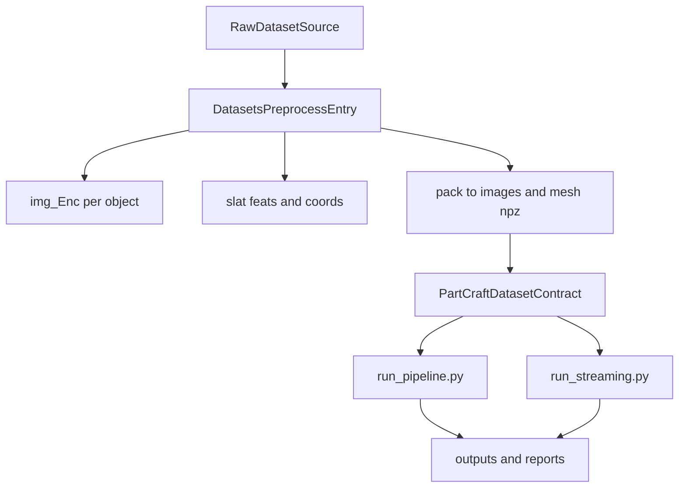

# PartCraft3D Architecture (Batch + Streaming)

## 主入口约定

- Batch 主入口：`scripts/run_pipeline.py`
- Streaming 主入口：`scripts/run_streaming.py`
- 约束：新增编排能力只能进入上述两个入口或其共享模块，不再新增并行的 standalone 编排前门。

## 共享编排层

- `scripts/pipeline_common.py`：配置读取、路径规范化、数据集构建、日志等共享能力。
- `scripts/pipeline_orchestrator.py`：`run_pipeline` 的主编排流程（context 构建、步骤执行、summary 收口）。
- `scripts/pipeline_paths.py`：shard/run token/report/manifest 路径派生与链接同步。
- `scripts/pipeline_jsonl.py`：JSONL 读写、去重、resume done 集合等通用逻辑。
- `scripts/pipeline_dispatch.py`：Step1/Step4 的多 worker 分发、等待、合并校验协议。
- `scripts/pipeline_diagnostics.py`：各 step 的统计诊断输出。
- `scripts/pipeline_step_3d.py`：Step4 3D 编辑核心逻辑拆分实现。

## Batch 流程职责

`scripts/run_pipeline.py` 负责 Step1-6 的可恢复批处理：

1. Step1 语义与 enrich
2. Step2 规划
3. Step3 2D 编辑预生成
4. Step4 TRELLIS 3D 编辑（支持多 GPU 分发）
5. Step5 质量评估
6. Step6 导出

输出遵循 shard 目录下 `pipeline/reports` 与 `pipeline/manifests`，保持 JSONL/resume 兼容。

### Step4 编辑产物格式（2026-03-30 对齐）

Step4 每个编辑对保存为 `mesh_pairs/{edit_id}/before.npz` + `after.npz`，每个 npz 包含：

- `slat_feats` `[N, C_slat]`：Stage-2 structured latent 特征
- `slat_coords` `[N, 4]`：体素坐标 `[batch, x, y, z]`
- `ss` `[C_ss, R, R, R]`：Stage-1 sparse structure VAE latent

所有编辑类型（modification/scale/material/global/deletion/addition/identity）均产出完整的 SS + SLAT 对。
deletion 通过 SLAT 过滤 + SS 编码产出；addition 从 deletion 复制并互换 before/after。

旧格式（`before_slat/feats.pt` + `coords.pt` 目录）由下游消费者兼容读取。

### Step1/Step4 中断恢复协议（2026-03-29 对齐）

Step1 与 Step4 的多 worker 执行统一采用“先合并、再失败”的恢复语义，避免 worker crash 时已完成结果丢失：

- `scripts/pipeline_dispatch.py`
  - `wait_for_workers(..., fail_fast=False)` 支持返回失败 worker 列表，交由调用方先做 merge/reconcile 再决定是否中断。
  - `discover_step1_worker_results()` 用于发现历史 `semantic_labels*_w*.jsonl` worker 产物。
  - `reconcile_worker_results(...)` 作为 Step1/Step4 通用合并校验入口（`reconcile_step4_results` 保留兼容包装）。
- `scripts/run_pipeline.py`
  - `run_step_semantic_multi_gpu` 在分发前先合并历史 worker 产物并计算 pending；worker crash 时先 merge 再 raise。
  - `run_step_3d_edit_multi_gpu` 同样改为 crash 时先 merge 再 raise。
  - worker 子进程日志落盘到 `cache/phase0/worker_w{i}.log`（Step1）用于定位 crash 原因。

### Step1 Prompt 生成职责（2026-03-29 对齐）

Step1 的 prompt 生成分为“VLM 主生成 + 模板兜底”两层：

- `partcraft/phase1_planning/enricher.py`：扩展 VLM 输出字段，新增 per-part `scale_edits`，并增强 `materials` 与 `global_edits` 的多样性指令。
- `partcraft/phase1_planning/planner.py`：接入 `type=="scale"` 与 VLM material/scale 结果，仅对未覆盖 part 应用模板 fallback。

## Streaming 流程职责

`scripts/run_streaming.py` 负责对象级流式处理，面向吞吐优先场景。与 batch 共用核心 phase 模块与 Step4 TRELLIS 能力。

## 数据预处理入口（scripts/datasets）

数据预处理的目标是把原始数据统一转换成 batch/streaming 可消费的数据契约：

- `data/*/images/{shard}/{obj_id}.npz`  — 打包后的多视角渲染图（`image_npz_dir`）
- `data/*/mesh/{shard}/{obj_id}.npz`    — 打包后的网格（含 `full.ply`）（`mesh_npz_dir`）
- `data/*/slat/{shard}/{obj_id}_feats.pt`、`{obj_id}_coords.pt`  — SLAT 编码（`slat_dir`）

### 管线 vs 预渲染数据路径职责（2026-03-30 对齐）

- **预渲染**产出并依赖 `img_Enc/`（`paths.img_enc_dir`）：原始渲染图 + `mesh.ply`
- **编辑管线**只依赖打包后的产物：`images/*.npz`、`mesh/*.npz`、`slat/`
- `derive_dataset_subpaths: true` 只自动派生 `image_npz_dir`、`mesh_npz_dir`、`slat_dir`，**不派生 `img_enc_dir`**
- `img_enc_dir` 在管线中唯一消费点是 `trellis_refine.py` 加载 VD mesh 的可选 fallback；不存在时从 `mesh.npz` 中读 `full.ply`

### 共享预处理能力

- `scripts/datasets/prerender_common.py`
  - GPU 发现、并行渲染调度、SLAT 编码、shard 切分与汇总。
  - `run_render/run_encode/launch_multi_gpu_encode` 支持显式 `dataset_root`，不再强依赖隐式环境变量。
  - 被 `partverse/prerender.py` 与 `partobjaverse/prerender.py` 复用。
- `partcraft/utils/config.py`
  - 预渲染模式下可启用 `load_config(..., for_prerender=True, prerender_mode=...)`。
  - 统一归一化 `paths.*`、`tools.*`，并将 `paths.images_npz_dir/mesh_npz_dir/slat_dir/img_enc_dir` 同步到 `data.*` 供 pipeline 侧复用。

## 预渲染配置驱动约定（新增）

预渲染链路采用“配置优先，机器无关”的路径契约。建议直接使用模板：

- `configs/prerender_partverse.yaml`
- `configs/prerender_partobjaverse.yaml`

关键字段：

- `paths.dataset_root`
- `paths.source_glb_dir`（PartVerse） / `paths.source_mesh_zip`（PartObjaverse）
- `paths.captions_json`（可选，PartVerse pack 使用）
- `paths.img_enc_dir`
- `paths.slat_dir`
- `paths.images_npz_dir`
- `paths.mesh_npz_dir`
- `tools.blender_path`
- `tools.blender_script`

行为规则：

- 预渲染脚本从 `--config` 读取路径，路径统一在配置层绝对化。
- 相对路径按项目根解析；迁移机器时优先仅改配置文件。
- 缺失关键键时 fail-fast 并指向对应配置项。
- 旧环境变量覆盖（`PARTVERSE_DATA_ROOT`、`PARTCRAFT_DATASET_ROOT`、`BLENDER_PATH`、`BLENDER_SCRIPT`）仅保留兼容并会给出 deprecation 提示。

### 严格配置模式（2026-03-29）

预渲染与管线执行改为“配置显式声明 + 启动期失败”：

- 关键路径不再在运行时隐式 fallback（例如 `dataset_root`、`slat_dir`、`img_enc_dir`、`image_edit_base_url`）。
- 缺失配置或路径无效时，直接抛出 `[CONFIG_ERROR]` 并包含 key、解析后的值、来源（config/env_override/derived）。
- `partcraft/utils/config.py` 会在加载后打印 `[CONFIG_PATH]`，用于审计最终生效路径与来源。
- `run_pipeline.py` / `run_streaming.py` / `prerender.py` 在 Step3/Step4 与 prerender 输入阶段执行强校验，不再“warning 后跳过步骤”。

### PartVerse 预处理链

- `scripts/datasets/partverse/prerender.py`
  - 主入口：`render -> encode -> pack`（支持 `--render-only/--pack-only/--encode-only`）。
  - 默认从 `configs/prerender_partverse.yaml` 读取路径；支持 `--config` 指定。
  - 产出：`img_Enc/`、`slat/{shard}/`、`images/{shard}/`、`mesh/{shard}/`。
- `scripts/datasets/partverse/pack_npz.py`
  - 将 `img_Enc` 和标注打包为 pipeline 输入 NPZ（含 `split_mesh.json`、`transforms.json`）。
- `scripts/datasets/partverse/repack_images_slim.py`
  - 对 `images/*.npz` 做视角瘦身，并可刷新 `part_id_to_name` 文本标签。
- `scripts/datasets/partverse/unpack_for_encode.py`
  - 从 NPZ 反解恢复 `img_Enc`（补跑 encode 时使用）。
- `scripts/datasets/partverse/verify_decode.py`
  - SLAT 解码可视化验收。
- `scripts/datasets/partverse/build_dino_test_dataset.py`
  - 构建 DINO/voxel 对齐测试集（研究与诊断用途）。

### PartObjaverse 预处理链

- `scripts/datasets/partobjaverse/prepare.py`
  - 数据准备入口：下载/解析 tiny 数据，转换到 `images/mesh` NPZ；可选 `--no-render`。
  - Blender 路径改为配置驱动：`tools.blender_path` / `tools.blender_script`（支持 CLI 覆盖）。
  - 可生成 `cache/phase0/semantic_labels.jsonl`。
- `scripts/datasets/partobjaverse/prerender.py`
  - 150 视角渲染 + SLAT 编码入口，使用 `paths.*` 统一读写目录。
- `scripts/datasets/partobjaverse/pack_npz.py`
  - 将 prerender 产物整理成 pipeline 输入 NPZ。
- `scripts/datasets/partobjaverse/build_dataset.py`
  - 从 pipeline 输出反向构建训练数据 JSON（后处理用途）。

## 端到端数据流



`scripts/pipeline_common.py` 的 `create_dataset()` 使用配置中的 `data.image_npz_dir` 与 `data.mesh_npz_dir` 构造 `PartCraftDataset`。因此 datasets 脚本与编辑入口之间的关键契约是 `images/mesh` NPZ 结构一致性。

## 保留目录

- `scripts/datasets/`：数据构建、预处理、打包、校验。
- `scripts/tools/`：运维与辅助工具（服务、下载、对比、测试等）。
- `scripts/vis/`：可视化与渲染辅助。
- `scripts/standalone/encode_slat.py`：保留为编码工具脚本（非主入口）。

## 已清理的冗余入口/模块

### 已删除 standalone 入口

- `scripts/standalone/run_all.py`
- `scripts/standalone/run_phase0.py`
- `scripts/standalone/run_phase1.py`
- `scripts/standalone/run_phase2.py`
- `scripts/standalone/run_phase2_5.py`
- `scripts/standalone/run_phase3.py`
- `scripts/standalone/run_enrich.py`
- `scripts/standalone/test_editformer.py`

### 已删除未使用阶段模块

- `partcraft/phase3_render/renderer.py`

## 非删除保留（风险控制）

以下文件虽非双入口直接 import，但属于可选路径或潜在配置分支，当前保留：

- `partcraft/phase3_filter/filter.py`
- `partcraft/phase2_assembly/alignment.py`

## Batch 管线运行器

`scripts/tools/run_shard_batch_pipeline.sh` 是 shard 级 batch 运行的推荐入口，按阶段顺序执行 Step12 → 3 → 4 → 5 → 6，自动管理服务启停和 GPU 资源复用。

### 机器配置驱动

所有机器相关路径（conda、checkpoint、数据）集中在 `configs/machine/<hostname>.env`，脚本启动时按 `$(hostname)` 自动加载。迁移新机器只需：

1. `cp configs/machine/node39.env configs/machine/<新主机名>.env`
2. 编辑路径
3. `SHARD=01 bash scripts/tools/run_shard_batch_pipeline.sh`

当前仓库已提供：

- `configs/machine/node39.env`
- `configs/machine/H200.env`（本机命名模板）

### 环境初始化脚本（部署/管线分离）

推荐先执行环境初始化，再运行 batch 管线：

- `scripts/tools/setup_deploy_env.sh`
  - 配置并校验 `CONDA_ENV_SERVER`（VLM + image edit 服务环境）
  - 默认读取 `configs/machine/$(hostname).env`，可用 `--machine-env` 覆盖
- `scripts/tools/setup_pipeline_env.sh`
  - 配置并校验 `CONDA_ENV_PIPELINE`（`run_pipeline.py` / `run_streaming.py` 运行环境）
  - 默认读取 `configs/machine/$(hostname).env`，可用 `--machine-env` 覆盖

常用命令：

```bash
bash scripts/tools/setup_deploy_env.sh
bash scripts/tools/setup_pipeline_env.sh

# 仅检查 machine env 与 conda 激活，不安装依赖
bash scripts/tools/setup_deploy_env.sh --check
bash scripts/tools/setup_pipeline_env.sh --check
```

本机适配示例：

- `configs/machine/wm1A800.env`
- 路径根统一到 `/mnt/cfs/vffey4/3dedit`（`ckpts` / `data/partverse` / `outputs/partverse`）

### 环境变量

| 变量 | 说明 | 示例 |
|------|------|------|
| `SHARD` | 目标 shard | `01` |
| `STEPS` | 执行步骤 | `12,3,4` 或 `all` |
| `LIMIT` | 限制对象数（调试用） | `3` |
| `VLM_GPUS` | VLM 服务 GPU | `0,4,5,6,7` |
| `VLM_TP` | VLM tensor parallel | `1`（单卡）或 `2` |
| `EDIT_GPUS` | 图像编辑服务 GPU | `0,4,5,6,7` |
| `STEP4_GPUS` | TRELLIS 3D GPU | `0,4,5,6,7` |

### GPU 资源生命周期

同一组 GPU 在步骤间复用，每步结束后自动 kill 服务释放显存：

- Step12：启动 VLM → 语义+规划 → kill VLM
- Step3：启动 FLUX → 2D 编辑 → kill FLUX
- Step4：子进程加载 TRELLIS → 3D 编辑 → 子进程退出
- Step5/6：CPU 为主

### machine env 必填字段

```
CONDA_INIT, CONDA_ENV_SERVER, CONDA_ENV_PIPELINE
VLM_CKPT, EDIT_CKPT, TRELLIS_CKPT_ROOT
DATA_DIR, OUTPUT_ROOT
```

### 权重下载与目录规范（本机）

- 权重根目录建议固定为：`/mnt/cfs/vffey4/3dedit/ckpts`
- 缺失本地推理权重时，使用：
  - `bash scripts/tools/download_local_missing_weights.sh`
- 脚本默认下载目录名与 machine env 对齐：
  - `Qwen3.5-27B`
  - `FLUX.2-klein-9B`
- 可通过环境变量覆盖仓库与目标目录（`VLM_REPO_ID` / `EDIT_REPO_ID` / `PARTCRAFT_CKPT_ROOT`），无需修改代码。

## 后续演进规则

- 不新增第三条主编排入口。
- 若引入新步骤，优先扩展 `run_pipeline` 的 step 体系和共享 `pipeline_*` 模块。
- streaming 侧只保留对象级增量能力，避免重复实现 batch 的全量编排语义。
